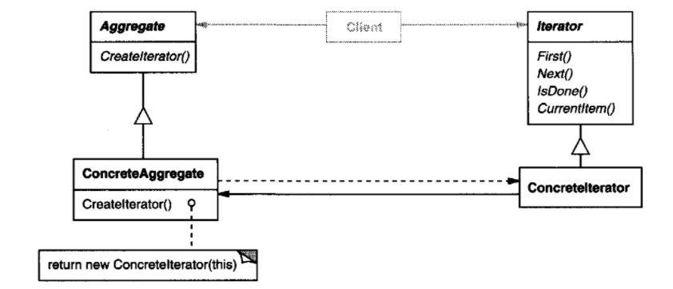
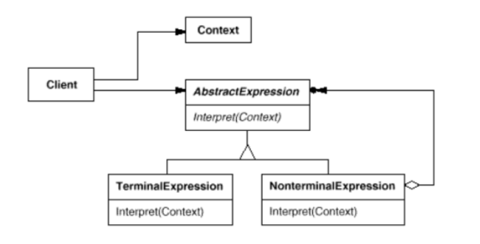

# Design Patterns in OOP
#
#
#1.Composite design

#
#2.Strategy design

#
#3.Decorator design

#
#4.Abstract Factory design

#
#5.Bridge design

#
#6.Command design

#
#7.Memento design

#
#8.Prototype design

#
#9.Singleton design

#
#10.Builder design

#
#11.Iterator design

#
#12.Chain of Responsibilities design

#
#13.Interpreter design

#
#14.Chain of Responsibilities design

